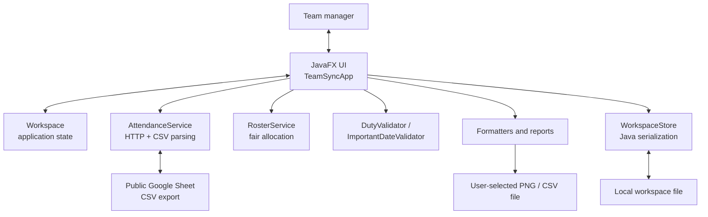
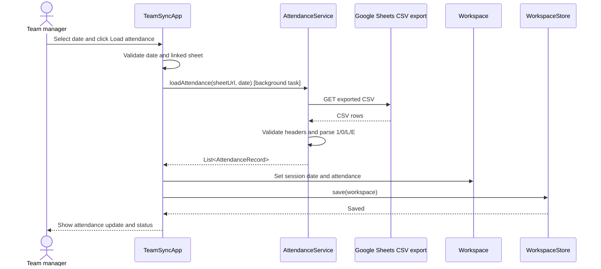
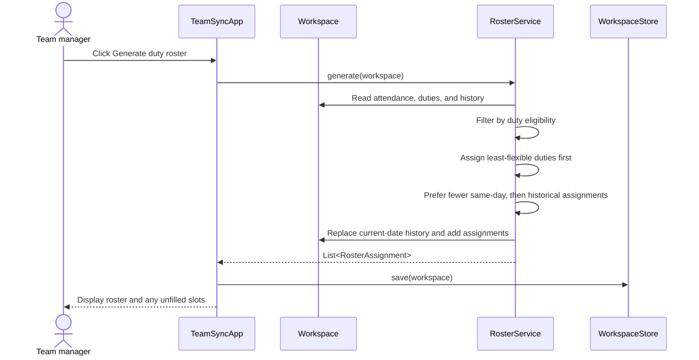
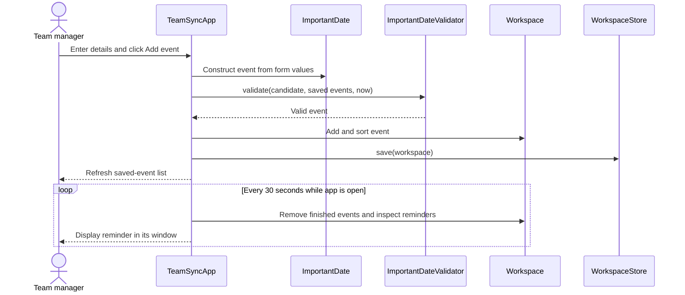
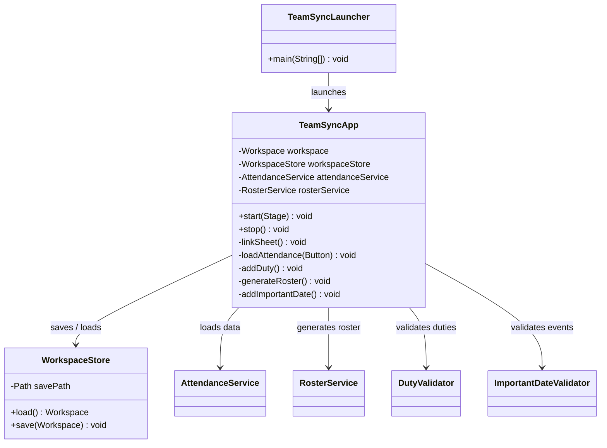
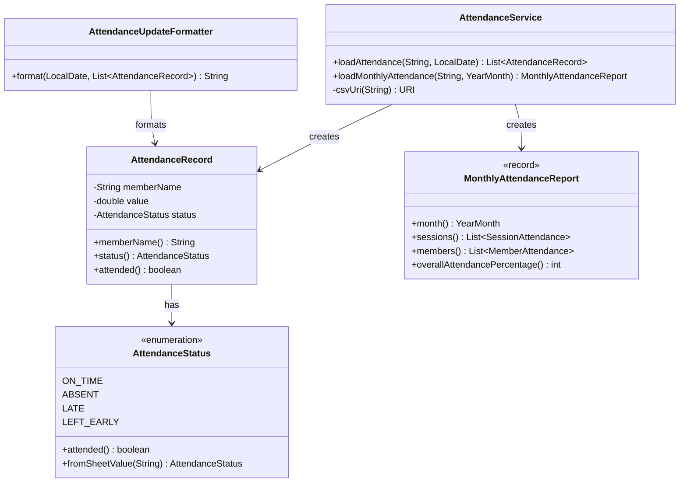
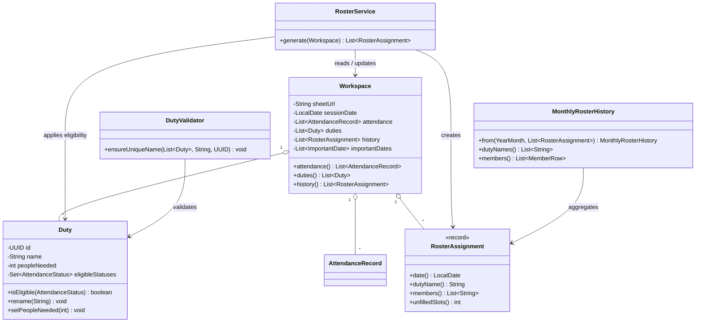
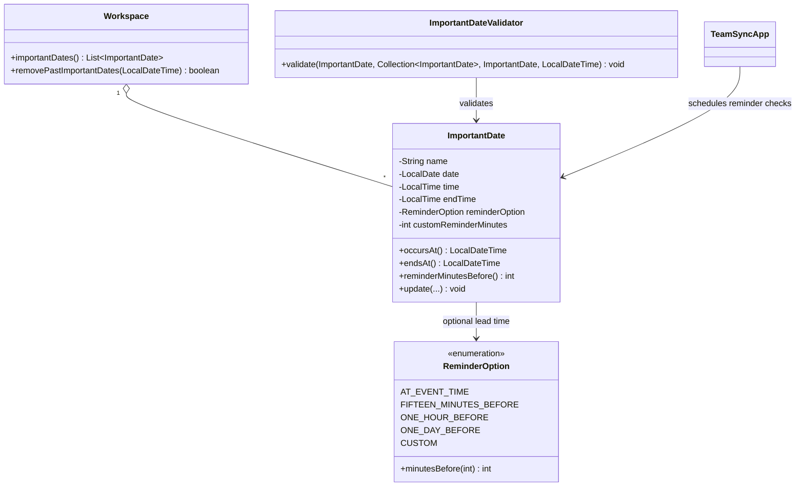

# TeamSync Developer Guide

## Design

### Architecture

TeamSync is a JavaFX desktop application. `TeamSyncApp` owns the user interface and coordinates use cases. It delegates attendance retrieval and interpretation to `AttendanceService`, roster allocation to `RosterService`, cross-event validation to validators, and persistence to `WorkspaceStore`. `Workspace` is the in-memory aggregate holding linked-sheet details, selected-session attendance, duties, roster history, and important dates.

The application performs attendance retrieval and attendance-export calculations in JavaFX background `Task`s, leaving the UI thread responsive. Local workspace changes are saved after successful state-changing actions and when the application stops.

### Sequence diagrams

#### Load attendance for a session

If the sheet URL, `Member` header, date column, or attendance values are invalid, `AttendanceService` returns an error to the UI. The UI retains the previous workspace data and displays the error.

#### Generate a duty roster

#### Save an important date and show a reminder

### Class diagrams

#### User-interface and application-coordination component

#### Attendance and reporting component

#### Duty-roster component

#### Important-dates component

## Requirements

### Product scope

**Target user:** Sport team managers who coordinate training sessions, members, duties, and competitions.

**Value proposition:** TeamSync links a shared attendance sheet to the day-to-day allocation of team duties. It gives a manager attendance-aware, balanced rosters, exports attendance and duty-history information, and keeps important team dates with optional reminders in one local workspace.

### User stories

Priorities: High (must have) — `***`; Medium (nice to have) — `**`; Low (unlikely to have) — `*`.

| Priority | As a … | I want to … | So that … |
| --- | --- | --- | --- |
| *** | Team manager | link a specific Google Sheet | I can use it as the attendance source for my team. |
| *** | Team manager | load attendance for a training date | I can see who is on time, late, leaving early, or absent. |
| *** | Team manager | add, edit, and delete duties | the duty list reflects what needs coverage. |
| *** | Team manager | generate a duty roster | I can quickly inform members of their duties. |
| *** | Team manager | review and export attendance statistics | I can share attendance information with coaches and teachers. |
| *** | Team manager | review and export duty-roster history | duty allocation is transparent and can be checked for fairness. |
| ** | Team manager | add, edit, and delete important dates | team events and deadlines are kept in one place. |
| ** | Team manager | receive reminders about important dates | I can act before an event begins. |
| * | Team manager | view a competition-readiness dashboard | I can track preparation milestones and availability. |

### Use cases

#### Use case: Link an attendance sheet

**MSS**

1. User enters a Google Sheets URL.
2. User selects **Link sheet**.
3. TeamSync validates the URL and saves it as the workspace attendance source.
4. TeamSync confirms that the sheet is linked.

   Use case ends.

**Extensions**

- 3a. The URL is not a valid Google Sheets URL.
  - 3a1. TeamSync shows an error message.

    Use case resumes at step 1.
- 3b. The workspace cannot be saved.
  - 3b1. TeamSync shows an error message.

    Use case ends.

#### Use case: Load session attendance

**MSS**

1. User selects a session date.
2. User selects **Load attendance**.
3. TeamSync reads the matching column from the linked Google Sheet.
4. TeamSync records each member's attendance state and displays a copy-ready attendance update.
5. TeamSync saves the selected date and loaded attendance.

   Use case ends.

**Extensions**

- 1a. User does not select a date.
  - 1a1. TeamSync shows an error message.

    Use case resumes at step 1.
- 2a. No sheet has been linked.
  - 2a1. TeamSync shows an error message.

    Use case ends.
- 3a. The sheet cannot be read or is not shared for access.
  - 3a1. TeamSync shows an error message.

    Use case ends.
- 3b. The first column is not named `Member`, the selected date has no column, a marked member has no value, or a value is not supported.
  - 3b1. TeamSync shows an error message describing the sheet problem.

    Use case ends.

#### Use case: Manage a duty

**MSS**

1. User enters a duty name, the number of people required, and one or more eligible attendance states.
2. User selects **Add duty**.
3. TeamSync validates the duty and adds it to the workspace.
4. TeamSync saves the workspace and refreshes the duty list.

   Use case ends.

**Extensions**

- 1a. The user leaves the duty name blank, sets fewer than one person, or selects no eligible attendance state.
  - 1a1. TeamSync shows an error message.

    Use case resumes at step 1.
- 3a. A duty with the same name already exists, ignoring case and surrounding whitespace.
  - 3a1. TeamSync shows an error message.

    Use case resumes at step 1.
- 2a. To edit or delete, the user selects **Update selected** or **Delete selected** without selecting a duty.
  - 2a1. TeamSync shows an error message.

    Use case ends.

#### Use case: Generate a duty roster

**MSS**

1. User loads attendance for a session and maintains at least one duty.
2. User selects **Generate duty roster**.
3. TeamSync selects only attendees eligible for each duty.
4. TeamSync prioritises duties with fewer eligible members, gives eligible members one duty before assigning a second, and then prefers members with fewer prior assignments for that duty.
5. TeamSync stores the resulting assignments in the roster history and displays the roster.

   Use case ends.

**Extensions**

- 1a. No attendance has been loaded.
  - 1a1. TeamSync shows an error message.

    Use case ends.
- 1b. No duties exist.
  - 1b1. TeamSync shows an error message.

    Use case ends.
- 3a. A duty has fewer eligible members than required.
  - 3a1. TeamSync fills the available slots and marks the remaining slots as unfilled.

    Use case resumes at step 5.
- 4a. There are fewer eligible members overall than duty slots.
  - 4a1. TeamSync assigns a second duty only when needed to fill remaining slots.

    Use case resumes at step 5.

#### Use case: Export monthly attendance statistics

**MSS**

1. User selects a date in the month to report.
2. User selects an attendance statistic and chooses **Export as image** or **Export as CSV**.
3. TeamSync reads the linked sheet and calculates the selected month's attendance data.
4. User chooses an output location in the file chooser.
5. TeamSync writes the PNG or CSV file and confirms the export.

   Use case ends.

**Extensions**

- 1a. User does not select a report month.
  - 1a1. TeamSync shows an error message.

    Use case resumes at step 1.
- 2a. No sheet has been linked.
  - 2a1. TeamSync shows an error message.

    Use case ends.
- 3a. The sheet cannot be read or contains no valid sessions in that month.
  - 3a1. TeamSync shows an error message.

    Use case ends.
- 4a. User cancels the file chooser.
  - 4a1. TeamSync does not create a file.

    Use case ends.

#### Use case: Manage an important date

**MSS**

1. User enters an event name, future date, start time, end time, and optional reminder.
2. User selects **Add event**.
3. TeamSync validates the event against the saved important dates.
4. TeamSync saves the event in chronological order and refreshes the event list.

   Use case ends.

**Extensions**

- 1a. The name, date, start time, or end time is missing or is incorrectly formatted.
  - 1a1. TeamSync shows an error message.

    Use case resumes at step 1.
- 1b. The end time is equal to or before the start time, or the event is in the past.
  - 1b1. TeamSync shows an error message.

    Use case resumes at step 1.
- 1c. A custom reminder is less than one hour before the event.
  - 1c1. TeamSync shows an error message.

    Use case resumes at step 1.
- 3a. The event name duplicates another saved event or its time overlaps another saved event.
  - 3a1. TeamSync shows an error message.

    Use case resumes at step 1.
- 2a. To update or delete, the user selects an action without selecting an event.
  - 2a1. TeamSync shows an error message.

    Use case ends.

#### Use case: Receive an important-date reminder

**MSS**

1. User has saved an upcoming event with a reminder enabled.
2. TeamSync is running when the configured reminder time occurs.
3. TeamSync displays a reminder notification for the event.

   Use case ends.

**Extensions**

- 2a. TeamSync is not running at the configured reminder time.
  - 2a1. No reminder is displayed.

    Use case ends.
- 2b. The event has finished.
  - 2b1. TeamSync removes the event from the workspace.

    Use case ends.

### Non-functional requirements

#### Performance

- TeamSync should keep the JavaFX interface responsive while downloading and processing attendance data; network retrieval and attendance-export calculations run outside the JavaFX UI thread.
- For a typical team spreadsheet and local workspace, loading a session, generating a roster, and producing a monthly view should complete promptly enough for interactive use. Long-running network operations should indicate progress and re-enable the related control when complete.
- Roster generation should scale with the number of loaded attendees, duties, and saved assignments without requiring external services.

#### Reliability

- TeamSync must reject invalid input before changing the saved workspace: invalid sheet URLs and layouts, unsupported attendance codes, invalid or duplicate duties, and invalid, duplicate, past, or overlapping events.
- The workspace should persist locally after successful changes and be loaded on a subsequent start. If a stored workspace is unreadable, TeamSync should start with a fresh workspace rather than fail to launch.
- Roster generation must not use absent members, must respect a duty's eligible attendance states, and must record unfilled slots when there are insufficient eligible members.
- A roster regenerated for the same date must replace that date's prior history rather than duplicate it.

#### Usability

- The application should make its main workflow discoverable through separate Overview, Attendance, Duties, Roster, and Important dates pages.
- Forms should provide concise labels, examples for date/time and sheet formats, and clear error messages that explain how the input can be corrected.
- Attendance updates, generated rosters, and monthly reports should use readable grouped or tabular presentations. Export actions should let the user choose the output location and format.
- Important-date reminders are shown only while the application is open; this limitation should be communicated in the interface.

#### Compatibility

- TeamSync requires a Java runtime compatible with Java 25 and JavaFX 25. The Gradle wrapper provisions the configured toolchain and platform-specific JavaFX libraries on supported macOS, Windows, and Linux systems.
- On Linux, JavaFX requires GTK 3.20 or later.
- Attendance input must be a publicly accessible Google Sheet whose first column is `Member` and whose session headers use ISO dates (`YYYY-MM-DD`). TeamSync accepts attendance values `1`, `0`, `L`, and `E` (plus the supported textual aliases).
- The local workspace is Java-serialized and is intended for the same user's TeamSync installation; it is not a shared, concurrent multi-user store.

## Planned enhancements 
1. Connection to the cloud. 
    1. Supports text notifications instead of only in-app reminders. 
   2. Supports synching of calendar between multiple people. 
   3. Statistics can be written back to the sheets instead of having to export every time. 
2. Better checks for duty and event names as accidental spacing between words will cause it to count as different names. 
   1. Example: “wash bibs” and “wash   bibs” are different even though they are referring to the same thing.
3. Competition tab to manage pre-competition administration work.
